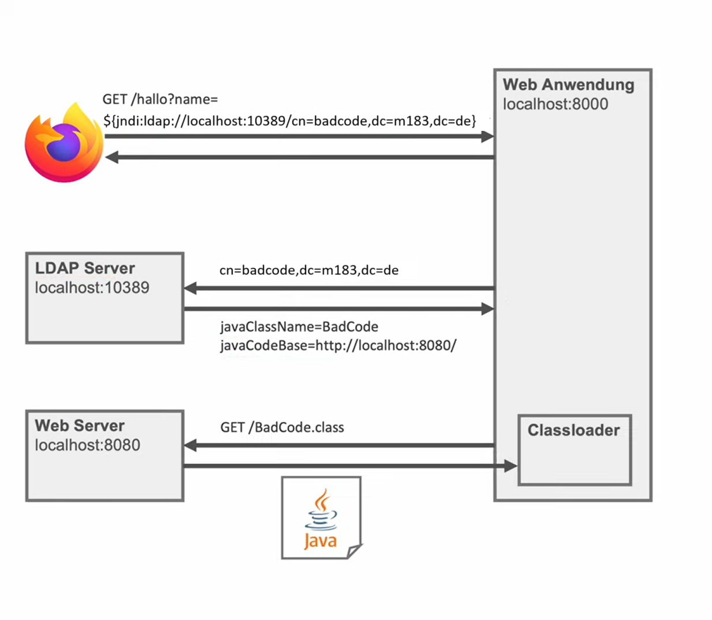

# Dokumentation Projektarbeit PROOF-OF-CONCEPT

------

## Mitarbeiter:

- Stefan Laux [GitHub](https://github.com/stefan-laux)
- Mischa Strauss [GitHub](https://github.com/mimasala)

------

### Fragestellung:

# Sind moderne Web-Applikationen durch Log4shell gefährdet?

## Zielsetzung

In diesem Projekt zeigen wir, wie Sicherheitslücken in Java-Webanwendungen ausgenutzt werden können. Dabei konzentrieren wir uns auf das spezifische OWASP-Sicherheitsproblem der **Remote Code Execution (RCE)**, das durch die Log4Shell-Schwachstelle ermöglicht wird. Das Hauptziel dieser Demonstration ist es, das Bewusstsein für diese Sicherheitslücke zu schärfen und die Bedeutung sicherer Programmierung und Konfiguration zu unterstreichen.

## Überblick über das Setup

Das Projekt besteht aus mehreren Java-Klassen:

1. **BadCode**:
    - Diese Klasse enthält absichtlich unsicheren Code, der abhängig vom Betriebssystem des Benutzers einen Taschenrechner öffnet.
    - Sie dient als Nutzlast, die später über eine LDAP-Injection ausgeliefert wird.

2. **HttpServer**:
    - Ein einfacher HTTP-Server, der die BadCode-Klasse zur Verfügung stellt.
    - Der Server läuft auf Port 8080 und liefert die BadCode.class-Datei aus, wenn diese angefragt wird.

3. **LdapServer**:
    - Ein In-Memory-LDAP-Server, der eine LDAP-Injection ermöglicht.
    - Der Server läuft auf Port 10389 und enthält eine Referenz zur BadCode-Klasse.

4. **Opfer**:
    - Eine einfache Webanwendung, die Anfragen auf Port 8000 entgegennimmt.
    - Diese Anwendung enthält einen Endpoint (/hallo), der den Namen des Benutzers als Parameter entgegennimmt und diesen in den Logs speichert.

## Demonstration des Sicherheitsproblems

Das OWASP-Sicherheitsproblem, das wir hier demonstrieren, ist **Remote Code Execution (RCE) über Log4Shell**. Diese Schwachstelle tritt auf, wenn ein Angreifer speziell formatierte Daten an eine Anwendung sendet, die von der Log4j-Bibliothek protokolliert werden. Wenn Log4j diese Daten protokolliert, kann es dazu kommen, dass die Anwendung ungewollt Code ausführt.

### Ablauf der Demonstration

1. **Vorbereitung der Umgebung**:
    - Starten Sie den HttpServer, um die BadCode.class-Datei bereitzustellen.
    - Starten Sie den LdapServer, der eine In-Memory-LDAP-Instanz betreibt und eine Referenz zur BadCode-Klasse enthält.
    - Starten Sie die Opfer-Anwendung.

2. **Ausnutzung der Schwachstelle**:
    - Ein Angreifer sendet eine speziell präparierte Anfrage an die Opfer-Anwendung, die eine schädliche Zeichenkette enthält.
    - Diese Zeichenkette wird in den Logs der Anwendung protokolliert.
    - Die Log4j-Bibliothek interpretiert die schädliche Zeichenkette und sendet eine LDAP-Abfrage an den LdapServer.
    - Der LdapServer liefert die BadCode-Klasse aus, die auf dem System des Opfers ausgeführt wird.

3. **Ergebnis**:
    - Die BadCode-Klasse wird auf dem System des Opfers ausgeführt, wodurch ein Taschenrechner geöffnet wird.
    - Dies zeigt, wie ein Angreifer durch die Ausnutzung der Log4Shell-Schwachstelle Schadcode ausführen kann.

## Fazit

Diese Demonstration zeigt eindrucksvoll, wie wichtig es ist, Eingaben von Benutzern immer zu validieren und zu bereinigen sowie sichere Versionen von Bibliotheken zu verwenden. Unsichere Konfigurationen und veraltete Bibliotheken können zu schwerwiegenden Sicherheitslücken führen, die von Angreifern ausgenutzt werden können. Entwickler sollten sich der Risiken bewusst sein und Maßnahmen ergreifen, um ihre Anwendungen zu schützen.

Wir hoffen, dass diese Demonstration dazu beiträgt, das Bewusstsein für Sicherheitslücken zu schärfen und Entwickler dazu ermutigt, sicherere und robustere Anwendungen zu schreiben.
